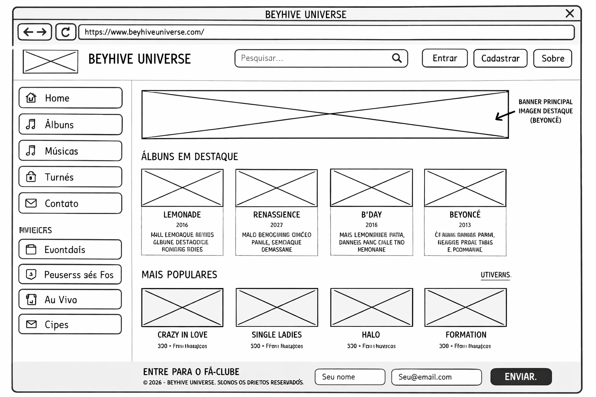

# Trabalho Prático - Semana 4 
> DWFE 2026/1 M

Dessa vez, vamos escolher uma proposta de projeto para trabalhar.

Nessa atividade, você deverá montar a página inicial do projeto escolhido, a organização do HTML aplicando semântica correta e uso aprimorado do CSS. Leia o enunciado completo no Canvas para mais detalhes.

**IMPORTANTE:** Você deve trabalhar e alterar apenas arquivos dentro da pasta **`public`**. Deixe todos os demais arquivos e pastas desse repositório inalterados. **PRESTE MUITA ATENÇÃO NISSO.**

---

## Informações Gerais

- Nome: Izadora Santiago Fernandes  
- Matrícula: 917459  
- Proposta de projeto escolhida: Pessoas e Produções  
- Breve descrição sobre seu projeto:  
Este projeto consiste na criação de uma página web chamada **Beyhive Universe**, dedicada à projetos da cantora Beyoncé. A página apresenta alguns de seus álbuns que eu mais gosto, e permite que usuários se inscrevam por meio de um formulário.

---

## Print do(s) wireframe(s) criado

---

## Print da home-page criada

